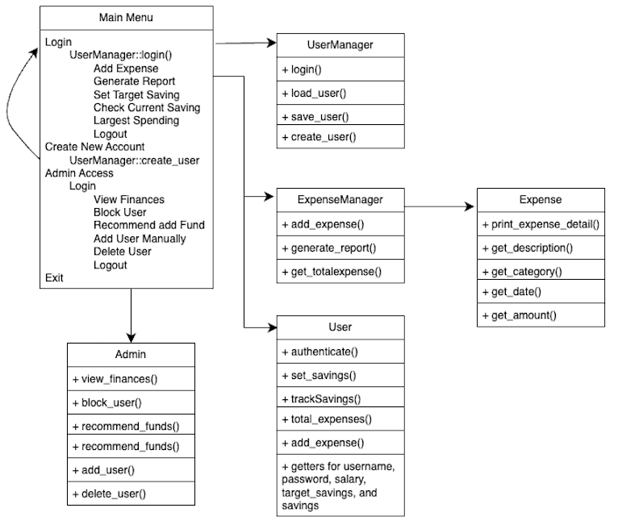
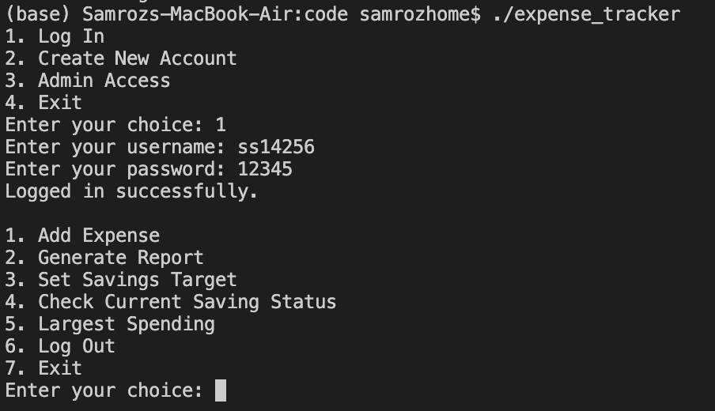
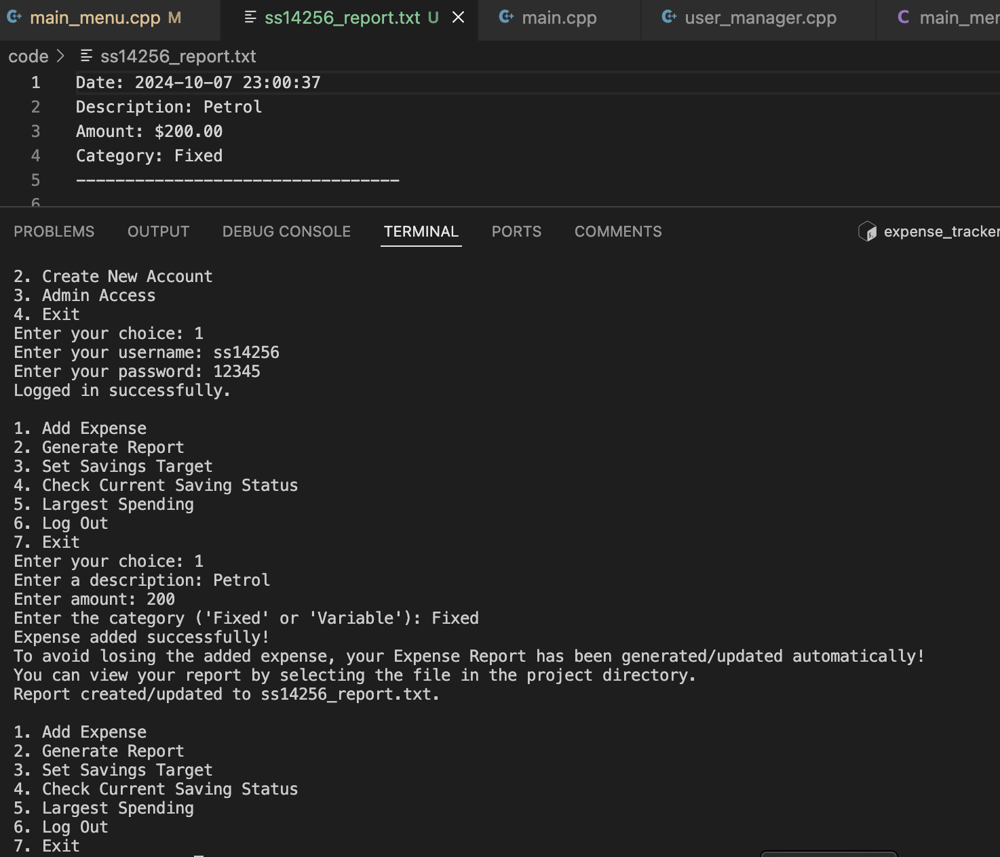
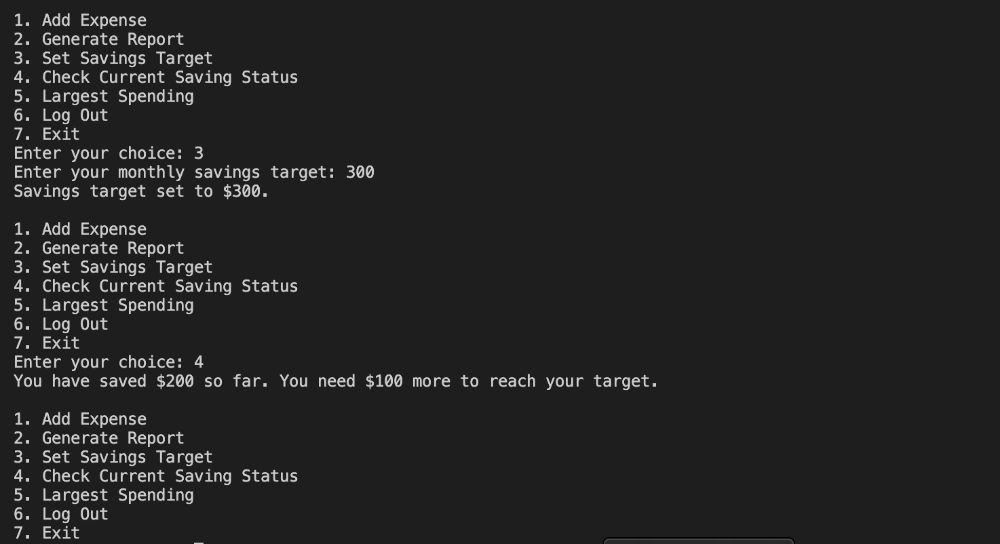

# Report
# Expense Tracker 

# Introduction

The expense tracker system that I developed is a console-based application built using the object-oriented programming (OOP) paradigm of the C++ programming language. This system provides users with the ability to efficiently manage their personal finances by tracking expenses, generating reports, setting savings targets, and monitoring their progress toward meeting those targets. The project incorporates several key concepts of OOP, enabling users to perform fundamental financial operations typically found in advanced expense tracking applications. In today’s world, managing expenses and savings is crucial for personal financial planning, and having a digital system to automate these tasks can significantly enhance accuracy, convenience, and financial awareness. The system also includes admin functionalities, such as viewing all user finances, recommending fund additions, and blocking suspicious users, ensuring comprehensive oversight and security.

# Approach

The approach to developing the expense tracker system revolves around leveraging key Object-Oriented Programming (OOP) concepts to ensure both functionality and security. The primary focus was on encapsulating data to prevent unauthorized access and maintain user privacy, as each user should only be able to view and interact with their own account. At the same time, the system includes admin functionalities that allow for oversight and management of multiple users. Security and privacy were kept at the forefront while building this system to ensure that users’ financial data remains protected.

The implementation of this system can be divided into two main parts:

## User:
The user has access to their own personal financial account where they can add expenses (categorized as fixed or variable), set a savings target, and check if their target has been met. Additionally, users can generate an expense report, retrieve their largest spending, and log out or exit the system. Each user is responsible for entering details such as the expense description, amount, and category, and the system will automatically track these to monitor savings and expenses. 

## Admin:
The admin, on the other hand, has full access to view all user finances. The admin can recommend that users add more funds, block accounts if suspicious activity is detected, and manually add or delete user accounts. Admin privileges ensure that the system maintains oversight while preserving the integrity and security of each user's data.

To ensure efficient implementation, the system contains several key classes that manage different functionalities. The user class encapsulates personal financial data, including expenses and savings targets. The admin class inherits from a shared base class, allowing it to view and manage other users' data but restricting its ability to modify personal financial details directly. The use of inheritance and encapsulation ensures that different access levels are maintained, providing clear role distinctions between regular users and administrators.

The flow of the program begins with a menu where users can log in, create a new account, or access the admin panel. Depending on the selection, the program directs the user to perform specific actions, keeping track of all transactions and operations securely. The table below shows the insight into functionality of main_menu().

| **Function Name**      | **Description**                                                                                                      |
|------------------------|----------------------------------------------------------------------------------------------------------------------|
| `MainMenu()`           | Constructor for the `MainMenu` class. Initializes `current_user` as `nullptr` and the admin user from `userManager`.  |
| `~MainMenu()`          | Destructor for `MainMenu`. Deletes the `current_user` object to free up memory.                                       |
| `run()`                | The main loop of the application. Displays the menu, handles user input, and navigates between options.               |
| `user_logged_in()`      | Checks if a user is currently logged in by verifying if `current_user` is `nullptr`.                                  |
| `user_login()`         | Prompts the user for their username and password to log into their account. Provides three attempts for login.         |
| `create_user()`        | Allows a new user to create an account by entering a username, password, and monthly salary.                           |
| `add_expense()`        | Allows the logged-in user to add an expense by specifying the description, amount, and category (fixed or variable).   |
| `generate_report()`    | Generates and displays an expense report for the logged-in user by retrieving the relevant data from `expenseManager`. |
| `set_savings()`        | Allows the user to set a monthly savings target by entering the desired savings amount.                                |
| `check_savings()`      | Compares the user’s current savings to the savings target and informs them if the target is met or how much is left.   |
| `largest_spending()`   | Reads the user's expense report and identifies the largest recorded spending amount.                                   |
| `admin_menu()`         | Displays the admin menu, allowing the admin to perform various actions such as viewing finances, blocking users, etc.  |
| `admin_login()`        | Authenticates the admin by verifying the entered password. Grants access to admin functionalities if correct.          |


# Flow Chart

Here is my Flowchart Diagram that describes the functionality of the system:




# Solution

The solution to the expense tracker system was achieved by carefully implementing key functionalities across various classes. Each class handled a specific part of the system, ensuring modularity and maintainability. Below is the breakdown of how the solution is structured across the major components:

### `MainMenu` Class:
The `MainMenu` class acts as the control center of the program, managing user interactions and navigation. It handles the display of the main menu, allows users to log in, create accounts, and gives admins access to administrative functions. The class also controls actions like adding expenses, generating reports, and tracking savings for logged-in users.

- **user_login()**: Authenticates users by checking their credentials.
- **create_user()**: Registers new users by prompting for username, password, and salary.
- **add_expense()**: Allows users to add a new expense, including details such as description, amount, and category.
- **generate_report()**: Generates and updates an expense report specific to the logged-in user.
- **set_savings()**: Allows users to set their monthly savings target.
- **check_savings()**: Compares the user’s current savings with the set target and informs them whether the target has been met.
- **admin_menu()**: Grants admins access to manage users, view finances, and block suspicious accounts.

**Example**: Handling the user menu and input selection:
```c++
void MainMenu::run() {
    bool running = true;
    int choice;

    while (running) {
        if (!user_logged_in()) {
            cout << "1. Log In\n";
            cout << "2. Create New Account\n";
            cout << "3. Admin Access\n";
            cout << "4. Exit\n";
            cin >> choice;
            if (choice == 1) user_login();
            else if (choice == 2) create_user();
            else if (choice == 3) admin_menu();
            else if (choice == 4) running = false;
        } else {
            cout << "1. Add Expense\n";
            cout << "2. Generate Report\n";
            cout << "6. Log Out\n";
            cin >> choice;
            if (choice == 1) add_expense();
            else if (choice == 2) generate_report();
            else if (choice == 6) current_user = nullptr;
        }
    }
}
```
### `Admin` Class:
The `Admin` class allows administrators to view and manage user accounts. Admins can block users, recommend that they add funds, and add or delete accounts. This provides a robust way to maintain security and oversight over the system.

- **view_finances()**: Admins can view the financial data (salary, total savings) of all users.
- **block_user()**: Blocks a user from the system if suspicious activity is detected.
- **recommend_funds()**: Recommends a user to add more funds based on their financial status.
- **add_user()**: Adds a new user to the system with a specified username, password, and salary.
- **delete_user()**: Removes a user from the system.

### `ExpenseManager` Class:
The `ExpenseManager` class is responsible for handling expense-related operations. It allows users to add expenses and generates personalized expense reports. The class also calculates the total expenses incurred by a user.

- **add_expense()**: Adds a new expense to the system and records it in the expense list.
- **generate_report()**: Creates or updates an expense report file for the current user, including detailed information such as date, description, and amount.
- **get_totalexpenses()**: Computes and returns the total amount of expenses a user has recorded.

### `Expense` Class:
The `Expense` class defines an individual expense, including attributes such as description, amount, category, and the date of the expense. This class provides encapsulation for each expense entry, ensuring data integrity.

- **Expense()**: Constructor that initializes an expense with a description, amount, category, and date.
- **get_description()**, **get_amount()**, **get_category()**, **get_date()**: Getters that retrieve specific details of an expense.

**Example**: Constructor and basic getter functions for expenses:
```c++
Expense::Expense(const string& d, double a, const string& c, time_t d_e)
    : description(d), amount(a), category(c), date(d_e) {}

string Expense::get_description() const { return description; }
double Expense::get_amount() const { return amount; }
```
### `User` Class:
The `User` class manages user information such as username, password, salary, expenses, and savings. It ensures that each user has a unique financial profile, tracks expenses, and compares actual savings with the set savings target.

- **authenticate()**: Verifies the user’s password for login.
- **set_savings()**: Sets the savings target for the user.
- **trackSavings()**: Calculates the actual savings by subtracting the total expenses from the salary.
- **add_expense()**: Adds an expense to the user’s expense history.
- **total_expenses()**: Calculates and returns the total expenses recorded by the user.
- **get_username()**, **get_password()**, **get_salary()**, **get_savings()**, **get_target_savings()**: Getters to retrieve the user’s details.

### `UserManager` Class:
The `UserManager` class manages the user database, handling user creation and login. It loads and saves user data to and from files, ensuring persistence across sessions.

- **load_users()**: Loads user data from a file upon program startup.
- **save_users()**: Saves user data to a file when updates occur.
- **login()**: Authenticates users by checking their credentials.
- **create_user()**: Registers a new user and saves the account data to the file.

### Data Persistence:
The system persists user and expense data through file handling mechanisms. User data is saved to a file (`users.txt`) upon account creation and updated when necessary. Expense reports are stored in individual files for each user, ensuring that data is retained across multiple sessions.

### Error Handling:
The system implements basic error handling, such as validating input and managing login attempts. It also ensures proper file handling for reading and writing data, preventing the loss of important information.

This approach successfully encapsulates functionalities in distinct classes, following the principles of Object-Oriented Programming (OOP), resulting in a maintainable and scalable expense tracking system.

**Example**: Validating user input in add_expense():
```c++
void MainMenu::add_expense() {
    double amount;
    string amount_str;
    do {
        cout << "Enter amount: ";
        getline(cin, amount_str);
        try {
            amount = stod(amount_str);
            break;
        } catch (const std::exception&) {
            cout << "\nEnter a valid number!\n";
        }
    } while (true);

    // rest of the functionality...
}
```

# Outputs 



# References

1.[GeeksforGeeks: File Handling in C++](https://www.geeksforgeeks.org/file-handling-c-classes/)

3.[GeeksforGeeks: Standard Template Library (STL) in C++](https://www.geeksforgeeks.org/the-c-standard-template-library-stl/)

4.[GeeksforGeeks: Exception Handling in C++](https://www.geeksforgeeks.org/exception-handling-c/)


5.[Programiz: C++ Class and Object](https://www.programiz.com/cpp-programming/class-object)


6.[cplusplus.com: File Input/Output](http://www.cplusplus.com/doc/tutorial/files/)


7.[GeeksforGeeks: Inheritance in C++](https://www.geeksforgeeks.org/inheritance-in-c/)


8.[TutorialsPoint: Encapsulation in C++](https://www.tutorialspoint.com/cplusplus/cpp_data_encapsulation.htm)
